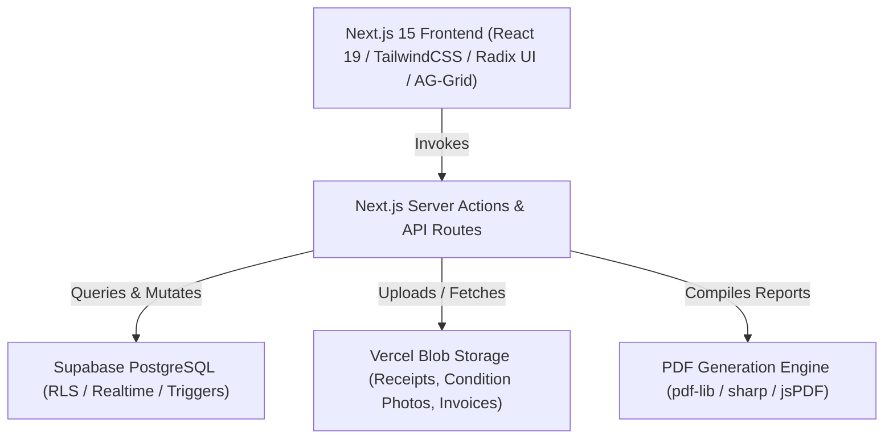

# 🏢 PropertyLedge

<div align="center">


[](https://nextjs.org/)
[](https://react.dev/)
[](https://www.typescriptlang.org/)
[](https://supabase.com/)
[](https://vercel.com/storage/blob)
[](https://www.ag-grid.com/)
[](https://playwright.dev/)

**An end-to-end, enterprise-grade Property Management, Lease Lifecycle, and Australian Tax/BAS Financial Ledger Platform.**

[Features](#-key-features) • [Architecture](#-tech-stack--architecture) • [Getting Started](#-getting-started) • [Environment Setup](#-environment-variables) • [Testing](#-test-suite--quality-assurance)

</div>

---

## 🌟 Executive Overview

**PropertyLedge** is a property management and financial intelligence system designed specifically for the Australian residential and commercial real estate market. It combines double-entry accounting principles with intuitive lease administration, compliance workflows, and multi-tenant cloud security.

---

## 🚀 Key Features

### 💰 1. Financial Ledger & BAS Accounting
* **ATO-Compliant BAS Reporting**: Native calculation of GST Exclusive, Inclusive, and GST-Free items with official ATO BAS codes (`G1`, `G10`, `G11`, `1A`, `1B`).
* **Multi-Page Accountant Reports**: Generates formal, dual-column Accountant Expense Reports with embedded high-resolution visual tax receipts, ABN validation, and payment verification stamps.
* **Bulk Expense Ingestion**: Drag-and-drop folder parsing engine that automatically detects categories, amounts, dates, and suppliers with background Vercel Blob cloud persistence.
* **Expected Payment Schedules & Reconciliations**: Automated schedule generators for recurring rent, outgoings, and maintenance contracts.

### 🏢 2. Property & Asset Management
* **Hierarchical Portfolios**: Manage multi-unit buildings, commercial complexes, and standalone residential properties.
* **Property Hubs**: Centralized command dashboards for financial performance, occupancy rates, cash flow metrics, and maintenance logs.
* **Real-time AG Grid Data Engine**: High-performance enterprise grids with persistent global expand/collapse preferences across all workspace views.

### 📝 3. Lease Lifecycle & Tenant Management
* **Comprehensive Lease Wizard**: Digital lease drafting, rent schedules, bonds, indexation clauses, and automated renewals.
* **Tenant Directory & Portal**: Secure tenant records, payment histories, notice generation, and tenant communication channels.
* **Condition Report Wizard**: Multi-room property condition inspector with photo defect uploads, room ratings, and digital signature capture.

### 🛡️ 4. Enterprise Security & Multi-Tenancy
* **Strict Row-Level Security (RLS)**: PostgreSQL-enforced multi-tenant data isolation.
* **Role-Based Access Control (RBAC)**: Fine-grained permissions for Platform Admins, Organization Owners, Property Managers, Accountants, and Tenants.
* **Immutable Audit Trail**: Detailed event streaming logging every transaction modification, lease update, and system action.

---

## 🛠 Tech Stack & Architecture



| Layer | Technology | Purpose |
| :--- | :--- | :--- |
| **Framework** | Next.js 15.5 (App Router, Server Actions) | Fullstack React framework |
| **UI Library** | React 19, TailwindCSS, Radix UI, Framer Motion | Design system |
| **Data Grid** | AG Grid React v36 | High-throughput data tables |
| **Database** | Supabase (PostgreSQL 15+) | Multi-tenant database with RLS |
| **File Storage** | `@vercel/blob` | Scalable receipt and invoice document store |
| **PDF Engine** | `pdf-lib`, `sharp`, `jspdf-autotable` | High-fidelity financial PDF reports |
| **Icons & Charts** | `lucide-react`, `recharts`, `d3` | UI icons and financial charts |
| **Testing** | Playwright Test Runner | Unit, Integration, and E2E QA |

---

## 🏁 Getting Started

### Prerequisites
* **Node.js**: `v20.0.0` or higher
* **Package Manager**: `pnpm` (recommended) or `npm`
* **Supabase Project**: Active Supabase database instance
* **Vercel Account**: Vercel Blob store for receipt attachments

### 1. Clone the Repository
```bash
git clone https://github.com/ashnv2247/Property_Ledge_Prod.git
cd Property_Ledge_Prod
```

### 2. Install Dependencies
```bash
pnpm install
```

### 3. Configure Environment Variables
Create a `.env.local` or `.env` file in the root directory (see [Environment Variables](#-environment-variables) below):
```bash
cp .env.example .env.local
```

### 4. Run the Development Server
```bash
pnpm run dev
```
Open [http://localhost:3000](http://localhost:3000) in your browser.

---

## ⚙️ Environment Variables

Ensure the following variables are configured:

```env
# Supabase Configuration
NEXT_PUBLIC_SUPABASE_URL=https://your-project.supabase.co
NEXT_PUBLIC_SUPABASE_ANON_KEY=eyJhbGciOi...
SUPABASE_SERVICE_ROLE_KEY=eyJhbGciOi...

# Vercel Blob Storage (Required for Receipts & Invoices)
BLOB_READ_WRITE_TOKEN=vercel_blob_rw_xxxxxxxxxxxxxxxx

# Transactional Email (Resend)
RESEND_API_KEY=re_xxxxxxxxxxxx
EMAIL_FROM=onboarding@propertyledge.com.au
EMAIL_FROM_NAME=PropertyLedge

# Application URLs
NEXT_PUBLIC_APP_URL=http://localhost:3000
NEXT_PUBLIC_SITE_URL=http://localhost:3000

# Administrator Configuration
ADMIN_EMAILS=admin@propertyledge.com.au
```

---

## 🧪 Test Suite & Quality Assurance

PropertyLedge includes a test suite covering ledger math, ATO BAS rules, receipt attachments, routing, and access control:

```bash
# Run the complete unit test suite
pnpm test

# Run Playwright E2E tests
pnpm run test:e2e

# Run type checks
pnpm run typecheck

# Production build validation
pnpm run build
```

---

## 📁 Project Structure

```
├── app/                        # Next.js 15 App Router pages & server actions
│   ├── (auth)/                 # Authentication & onboarding flows
│   ├── actions/                # Server actions (finance, expenses, invoices)
│   ├── admin/                  # Platform administration & system roles
│   ├── api/                    # REST endpoints (webhooks, automation, receipts)
│   └── dashboard/              # Main workspace hubs (properties, leases, bas)
├── components/                 # React UI components
│   ├── admin/                  # AG Grid data grids & admin UI primitives
│   ├── dashboard/              # Property, lease, and tenant view components
│   ├── finance/                # Ledger, expense modals, and receipt drawers
│   ├── invoices/               # Invoice builder, templates & previewers
│   └── reports/                # Accountant Report & Condition Report modals
├── lib/                        # Core utilities & domain services
│   ├── auth/                   # Supabase authentication helpers
│   ├── finance/                # Financial ledger, BAS engine, receipt storage
│   ├── hooks/                  # Custom hooks (e.g., useGridExpandedPreference)
│   └── pdf/                    # High-resolution PDF builders & SVG receipt generators
├── modules/                    # Domain models, validation schemas & DTOs
├── supabase/                   # SQL migrations, RLS policies, and schema files
└── tests/                      # Playwright unit and e2e test specifications
```

---

## 📄 License

Proprietary — All rights reserved. PropertyLedge Australia.
